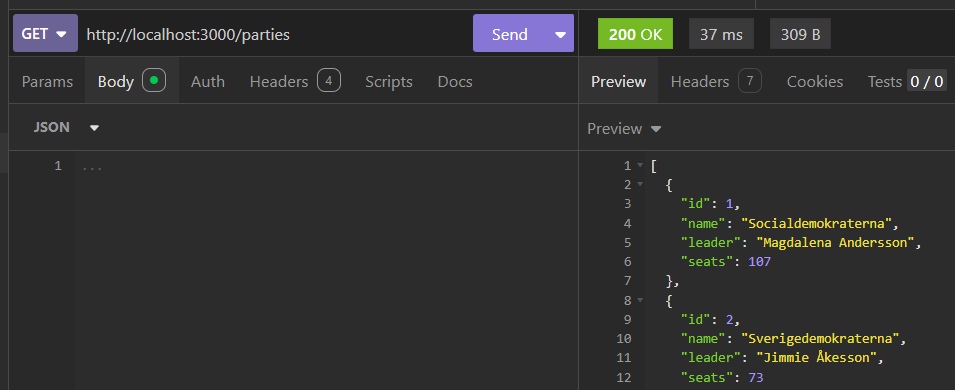
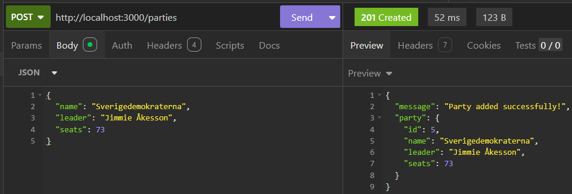
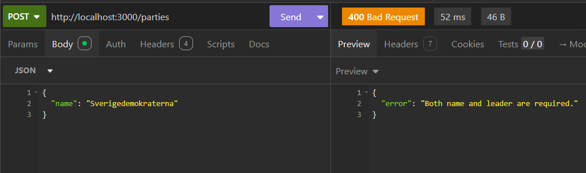
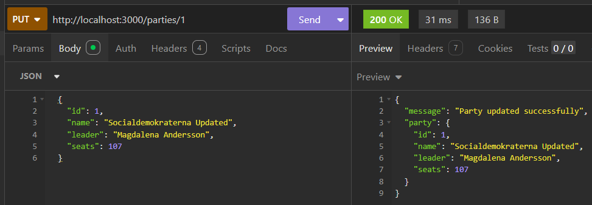
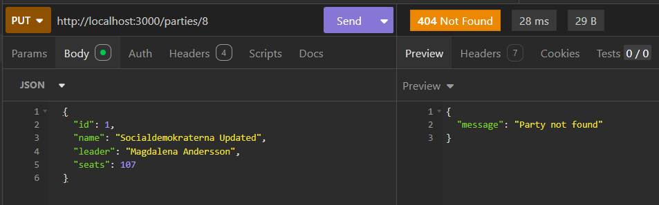
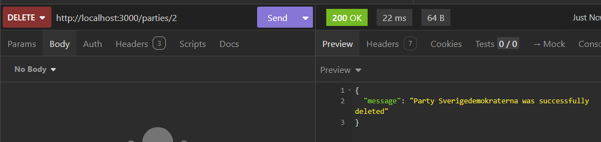
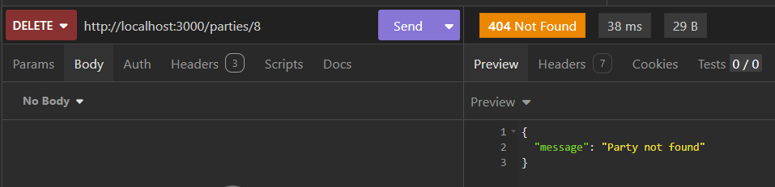

# Swedish Political Parties API

## API Routes Overview

| Method | Route | Request Body | Description & Expected Return | Expected Status Codes |
| :--- | :--- | :--- | :--- | :--- |
| `GET` | /parties | *None* | Returns a list of all political parties (JSON array). | 200 OK |
| `POST` | /parties | { "name": string, "leader": string, "seats"?: number } | Adds a new party and returns a success message with the created party object (`seats` defaults to `0` if omitted). | 201 Created (Success) 400 Bad Request (Missing `name` or `leader`) |
| `PUT` | /parties/:id | { "name"?: string, "leader"?: string } | Updates an existing party's `name` and/or `leader` by ID and returns a confirmation message with the updated party. | 200 OK (Success) 404 Not Found (Invalid ID) |
| `DELETE` | /parties/:id | *None* | Deletes a party by ID and returns a confirmation message including the deleted party's name. | 200 OK (Success) 404 Not Found (Invalid ID) |

---

## Insomnia Screenshots

- **GET `/parties` (Success)**  
  

- **POST `/parties` (Success - 201 Created)**  
  

- **POST `/parties` (Error - 400 Bad Request)**  
  

- **PUT `/parties/:id` (Success - 200 OK)**  
  

- **PUT `/parties/:id` (Error - 404 Not Found)**  
  

- **DELETE `/parties/:id` (Success - 200 OK)**  
  

- **DELETE `/parties/:id` (Error - 404 Not Found)**  
  

  **Seats not included in post (TASK 6)**
  
