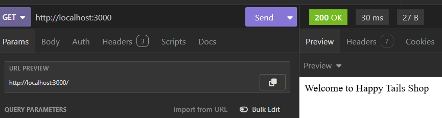
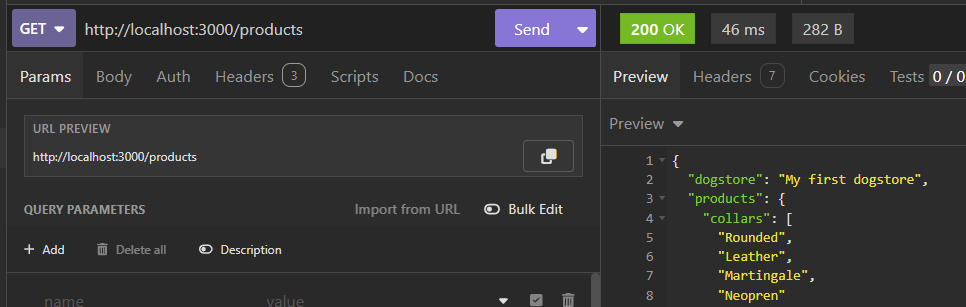
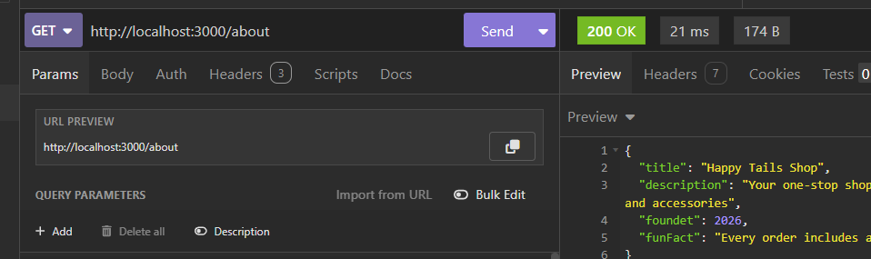
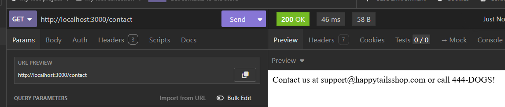
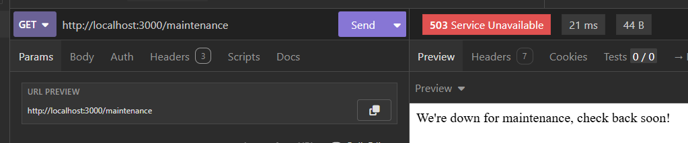
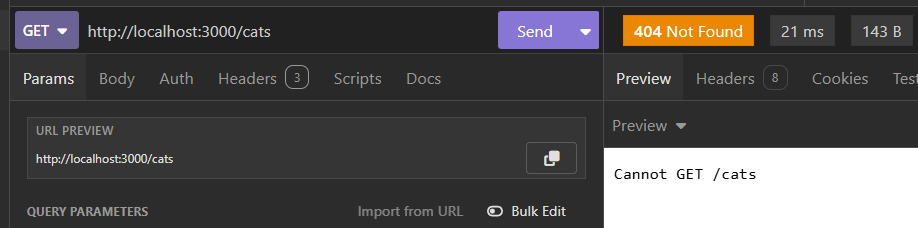

# Happy Tails Shop API

##  API Routes Overview

| Method | Route | Description | Expected Status Code | Response Format |
| :--- | :--- | :--- | :--- | :--- |
| `GET` | / | Welcome message | 200 OK | Text |
| `GET` | /products | Dog products list | 200 OK (explicit) | JSON |
| `GET` | /about | Shop information | 200 OK | JSON |
| `GET` | /contact | Contact details | 200 OK | Text |
| `GET` | /maintenance | Downtime notification | 503 Service Unavailable | Text |
| `GET` | *(invalid path)* | Non-existent route | 404 Not Found | Text/HTML |

---

## Insomnia Screenshots

- **GET `/`**  
  

- **GET `/products`**  
  

- **GET `/about`**  
  

- **GET `/contact`**  
  

- **GET `/maintenance`**  
  

- **GET 404 Test**  
  